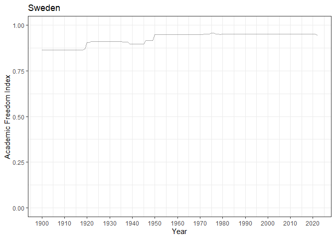
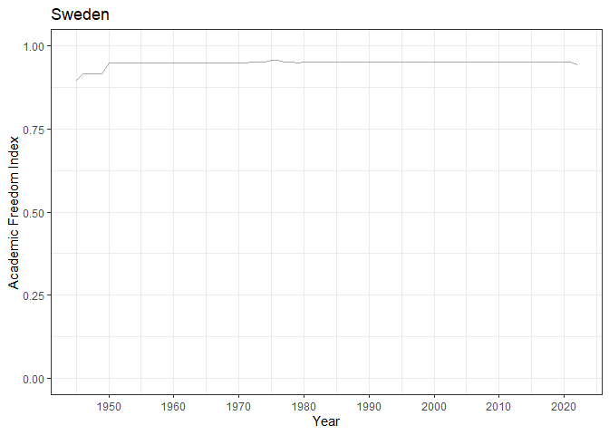
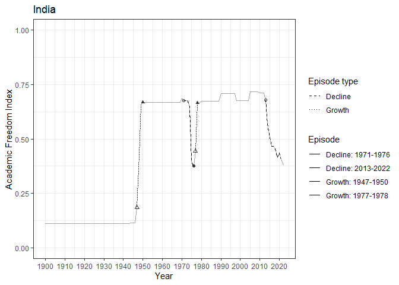
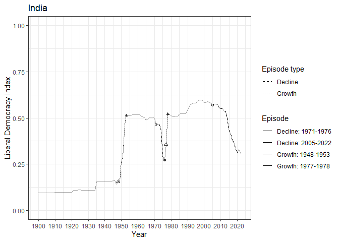

# plot_all_episodes

<!-- plot_all_episodes.md is generated from plot_all_episodes.Rmd. Please edit that file -->

In the context of this package, the `plot_all_episodes()` function
returns a ggplot object and produces a plot that shows the global number
or share of countries undergoing growth and decline episodes in a
specific variable in a selected time frame. The `plot_all_episodes()`
function does not control for overlapping uncertainty intervals before
the start of an episode an at the end of an episode.

## The `plot_all_episodes()` function

By default, `plot_all_episodes()` returns a ggplot() object in R
implementing the episode approach to measure growth and decline episodes
of the Academic Freedom Index as suggested in Lott (2023):

``` r
library(EpisodeR)

fig1 <- plot_all_episodes()
fig1
```



The `plot_all_episodes` function does not consider measurement
uncertainty in the measurement of the index variables.

By using the default values, users get a ggplot() object comparable to
Figure 1A presented in Lott (2023). However, users are also able to
customize the default parameters and use other V-Dem index variables
than the Academic Freedom Index.

## Customizing the `plot_all_episodes()` function with user-specific parameters and variables

There are different ways users can customize the parameters and set
other V-Dem index variables. Users can use the following arguments:
`abs`, `years`, `variable`, `var_label`, `start_incl`, `cum_incl`,
`year_turn`.

### `abs`: Logical Value: absolute number of countries or relative share of countries

The `abs` argument enable users to plot the absolute number of countries
in an episode for each year if the `abs` argument is set to TRUE. If the
`abs` argument is set to FALSE, the plot shows the relative share of
countries in percentage undergoing growth or decline for each year. By
default, the `abs` argument is set to TRUE.

``` r
fig2 <- plot_all_episodes(abs = FALSE)
fig2
```



### `years`: Vector with two numeric values indicating the minimum and maximum year to be plotted.

Vector with two numeric values indicating the minimum and maximum year
to be plotted. By default, the vector is set to c(1900, 2022).

``` r
fig3 <- plot_all_episodes(years = c(1990, 2022))
fig3
```



### `variable`: Change the index variable that constitutes episodes of change

The `variable` argument enable users to get episodes for any V-Dem index
variable, e.g. the Liberal Democracy Index (LDI), the Vertical
Accountability Index, and the Liberal Component Index. Users should be
extremely cautions in using variables, which are not scaled between 0
and 1, even it is possible to use other variable from the V-Dem
universe. By default this variable is set to “v2xca_academ”.

``` r
fig4 <- plot_all_episodes(variable = "v2x_libdem")
fig4
```



### `start_incl`: Set the paramater that is necessary to trigger the start of an episode

The `start_incl` argument enable users to change the parameter that is
necessary to trigger the start of an episode. This is the absolute value
of the first difference. By default, this value is set to 0.01. The
`plot_all_episodes()` function follows the potential episode as long as
there is continued increase/decline, while allowing up to four years of
temporary stagnation, meaning no further increase/decline of
`start_incl` points or more on the respective variable.

### `cum_incl`: Set the minimum amount of total change on the index variable necessary to constitute a growth or decline episode

The `cum_incl` argument allows for changing the minimum amount of total
change on the index variable necessary to constitute a growth or decline
episode? To identify substantive growth and decline episodes,
`plot_all_episodes()` function calculates the total magnitude of change
from the year before the start of an episode to the end of an episode.
This cumulative increase/drop is set to 0.1 by default (10% of the total
0–1 scale). It thus records only those manifest growth episodes which
add up to a positive change of at least `cum_incl` and as manifest
decline episodes only those which add up to a negative change of at
least `cum_incl`.

### `year_turn`: Set the parameter that is necessary to trigger the end of an episode

The `year_turn` argument enable users to change the parameter that is
necessary to trigger the end of an episode. By default, this value is
set to 0.03. The `plot_all_episodes()` function terminates an episode
when there is a temporary stagnation on the AFI with no further
increase/decline of `start_incl` points in four years or when the AFI
decreases/increases by `year_turn` points, from one year to the next.

<div id="refs" class="references csl-bib-body hanging-indent">

<div id="ref-lott_academic_2023" class="csl-entry">

Lott, Lars. 2023. “Academic Freedom Growth and Decline Episodes.”
*Higher Education*, December.
<https://doi.org/10.1007/s10734-023-01156-z>.

</div>

</div>
